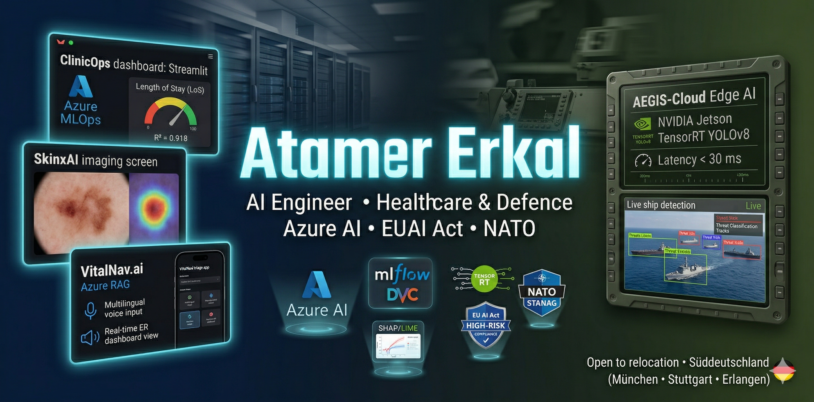
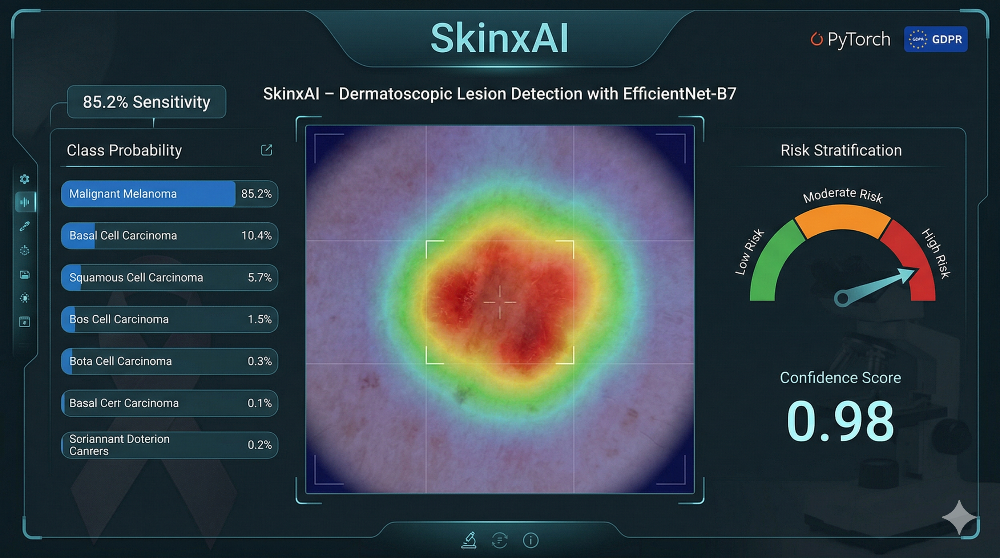
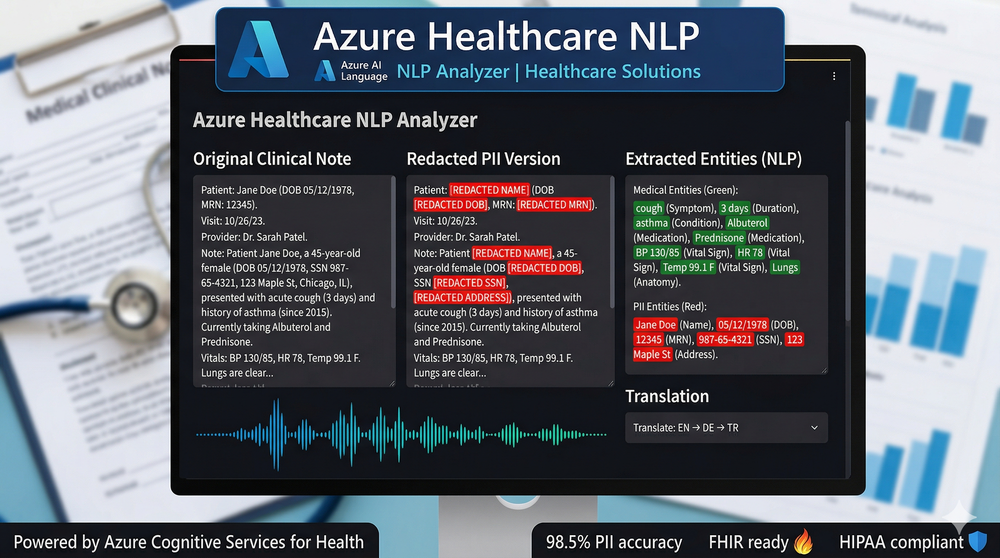
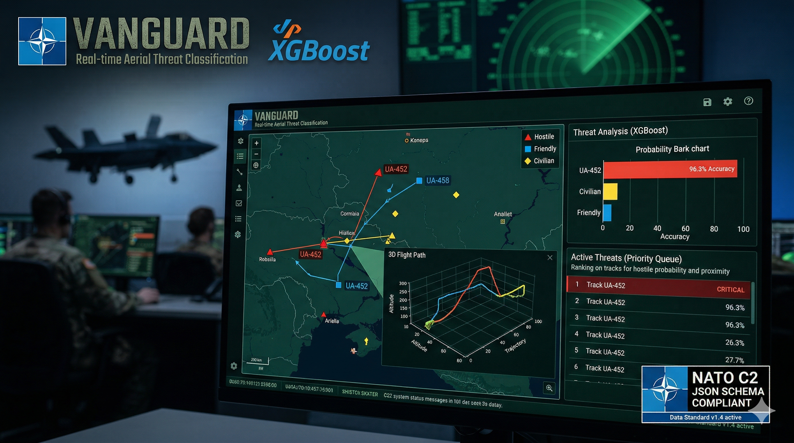
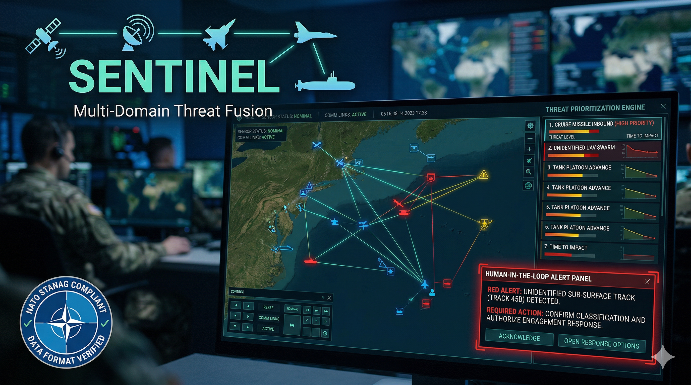
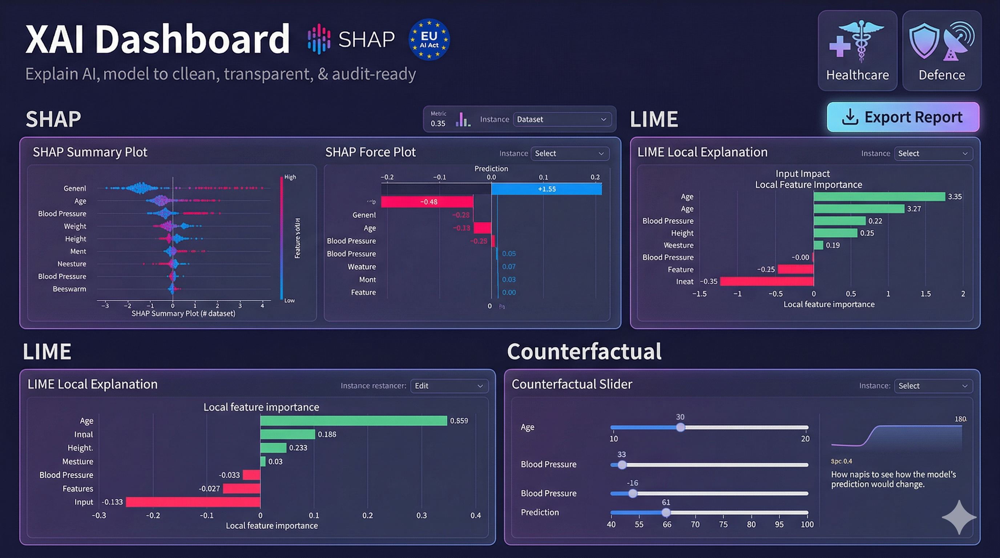
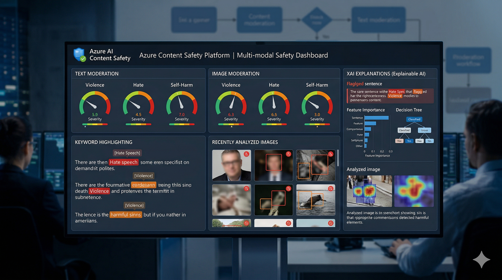
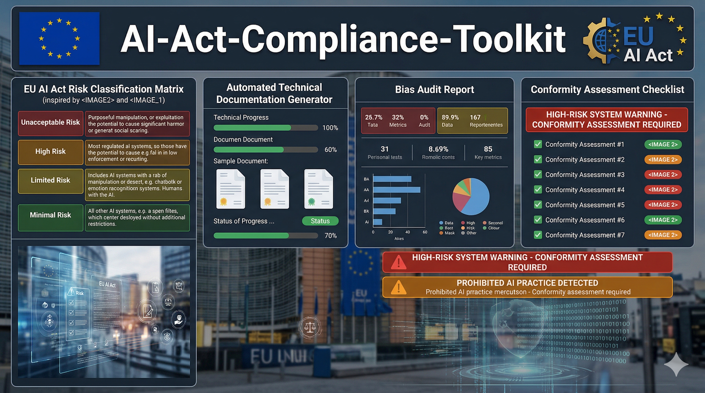

  

<h1 align="center">Atamer Erkal</h1>
<h3 align="center">Healthcare & Defence AI Engineer · Former NATO Planning Officer · Azure AI (AI-102 · Apr 2026)</h3>

  Building production-grade AI systems for regulated, safety-critical domains 
  where domain expertise meets operational excellence.

  
  
  

---

## 🧭 About

**AI & MLOps Engineer** with a rare combination of **healthcare domain expertise**, **NATO operational planning**, and **production ML engineering**.

I design end-to-end ML pipelines for **medical imaging**, **clinical decision support**, **threat classification**, and **multi-domain situational awareness** — always with a focus on **explainability**, **EU AI Act compliance**, and **GDPR-aware** data handling.

> *15+ years in safety-critical & regulated environments · Former Joint Planner at NATO ·  
> Program Director who trained 200+ data scientists with 90% placement rate · Azure AI Engineer (AI-102 · Apr 2026)*

---

## ⚙️ Tech Stack

<table>
<tr>
<td><b>AI / ML</b></td>
<td>
  
  
  
  
  
  
</td>
</tr>
<tr>
<td><b>MLOps / Cloud</b></td>
<td>
  
  
  
  
  
  
</td>
</tr>
<tr>
<td><b>Data</b></td>
<td>
  
  
  
  
</td>
</tr>
<tr>
<td><b>Explainability</b></td>
<td>
  
  
  
  
</td>
</tr>
<tr>
<td><b>Regulatory</b></td>
<td>
  
  
  
  
</td>
</tr>
</table>

---

## 🏥 Healthcare AI Projects

AI-driven clinical systems designed for real-world medical workflows — from diagnostics to operations.

<table>
<tr>
<td width="50%">

### ⚕️ [SkinxAI — Medical Imaging Classifier](https://github.com/AtamerErkal/skin-lesion-classifier)

**EfficientNet-B7** model on HAM10000 achieving **85.2% sensitivity** for malignant lesion detection.  
GDPR-compliant with **Grad-CAM** visual explainability for clinical trust.

`PyTorch` `EfficientNet-B7` `Grad-CAM` `GDPR`

[GitHub](https://github.com/AtamerErkal/skin-lesion-classifier) · [Live Demo](https://skinxai.streamlit.app/)
</td>

<td width="50%">

### 🏥 [ClinicOps — End-to-End MLOps Platform](https://github.com/AtamerErkal/ClinicOps)

Hospital stay prediction (**R² = 0.918**) with full lifecycle MLOps.  
MLflow tracking, DVC versioning, Docker, CI/CD, and real-time drift detection.

`MLflow` `DVC` `Azure` `Docker` `GitHub Actions`

[GitHub](https://github.com/AtamerErkal/ClinicOps)
</td>
</tr>

<tr>
<td width="50%">

### 🔬 [Azure Healthcare NLP Analyzer](https://github.com/AtamerErkal/azure-healthcare-nlp-analyzer)

Clinical text analysis pipeline using **Azure AI Language** for medical entity recognition.  
Extracts diagnoses, medications, symptoms, and relations from unstructured clinical notes.

`Azure AI` `NLP` `Healthcare` `Text Analytics`

[GitHub](https://github.com/AtamerErkal/azure-healthcare-nlp-analyzer)
</td>

<td width="50%">

### 📊 [Health Anomaly Detection](https://github.com/AtamerErkal/health-anomaly-detection)

Anomaly detection system for clinical health metrics and patient monitoring data.  
Designed for early warning in healthcare operations.

`Anomaly Detection` `Healthcare` `Python`

[GitHub](https://github.com/AtamerErkal/health-anomaly-detection)
</td>
</tr>
</table>

---

## 🛡️ Defence AI Projects

Mission-critical AI for NATO-compatible command & control and threat assessment.

<table>
<tr>
<td width="50%">

### 🎯 [VANGUARD — Air Track Classification](https://github.com/AtamerErkal/VANGUARD_Project)

Real-time aerial threat classification (**Hostile / Friendly / Civilian**) for NATO C2 systems.  
**XGBoost** with 3D flight path visualization and automated anomaly detection.

`Python` `XGBoost` `3D Visualization` `Defence AI`

[GitHub](https://github.com/AtamerErkal/VANGUARD_Project) · [Live Demo](https://vanguard-ai.streamlit.app/)
</td>

<td width="50%">

### 🔜 **SENTINEL — Multi-Domain Situational Awareness** *(Coming Soon)*

Multi-domain fusion dashboard integrating land, sea, and air threat data.  
NATO STANAG-referenced data formats with human-in-the-loop decision support.

`Sensor Fusion` `Multi-Domain Ops` `Real-Time AI`
</td>
</tr>
</table>

---

## 🔍 Responsible AI & Compliance

Explainability, fairness, and EU AI Act readiness for high-risk AI systems.

<table>
<tr>
<td width="50%">

### 🔍 [XAI Dashboard — Explainable AI](https://github.com/AtamerErkal/explainable_ai_dashboard)

Interactive **SHAP & LIME** dashboard for transparent model decisions.  
Audit-ready for healthcare and defence applications with counterfactual explanations.

`SHAP` `LIME` `Streamlit` `Explainable AI`

[GitHub](https://github.com/AtamerErkal/explainable_ai_dashboard) · [Live Demo](https://xai-dashboard.streamlit.app/)
</td>

<td width="50%">

### 🛡️ [Azure Content Safety Platform](https://github.com/AtamerErkal/azure-content-safety-platform)

Content safety and moderation platform built on **Azure AI Content Safety**.  
Detecting harmful content across text and images for responsible AI deployment.

`Azure AI` `Content Safety` `Responsible AI`

[GitHub](https://github.com/AtamerErkal/azure-content-safety-platform)
</td>
</tr>

<tr>
<td width="50%">

### 🧠 [EchoBreaker — Cognitive Bias Detection](https://github.com/AtamerErkal/EchoBreaker)

AI system for detecting echo chambers and cognitive biases in information environments.  
Critical for both clinical decision-making and operational intelligence analysis.

`NLP` `Bias Detection` `Responsible AI`

[GitHub](https://github.com/AtamerErkal/EchoBreaker)
</td>

<td width="50%">

### 🔜 **AI-Act-Compliance-Toolkit** *(Coming Soon)*

Open-source compliance framework for **EU AI Act (Aug 2026)** high-risk systems.  
Risk classification templates, technical documentation generators, and bias audit tools.

`EU AI Act` `Compliance` `High-Risk AI`
</td>
</tr>
</table>

---

## 🎖️ Background & Differentiators

<table>
<tr>
<td>🏥</td>
<td><b>Healthcare AI Domain Expert</b> — Deep focus on medical imaging, clinical decision support, patient analytics, and regulatory compliance (GDPR, EU AI Act, HL7 FHIR)</td>
</tr>
<tr>
<td>🎖️</td>
<td><b>Former NATO Joint Planner</b> — 15+ years in multinational operations, C2 systems, resource allocation, and mission-critical environments</td>
</tr>
<tr>
<td>☁️</td>
<td><b>Azure AI Engineer</b> — AI-102 certification scheduled April 2026 · Production experience with Azure ML, Azure AI Language, and Azure Content Safety</td>
</tr>
<tr>
<td>🎓</td>
<td><b>Electronics Engineer</b> — BSc in Electronics Engineering with dual Master's degrees in Leadership & Public Relations from National Defence University</td>
</tr>
<tr>
<td>👨‍🏫</td>
<td><b>Program Director</b> — Trained 200+ data scientists at Clarusway IT School with 90% industry placement rate</td>
</tr>
<tr>
<td>🏆</td>
<td><b>Awards</b> — Best Data Science Bootcamp (2021 & 2022), Certificate of Honor from Turkish Naval Forces Commander</td>
</tr>
<tr>
<td>🌍</td>
<td><b>Languages</b> — Turkish (Native) · English (Fluent) · German (B2 – TELC / 2025)</td>
</tr>
</table>

---

  <b>Currently seeking opportunities in Healthcare AI & Defence AI across Southern Germany</b> 
  <i>Open to roles at the intersection of healthcare/defence domain expertise, MLOps engineering, and EU AI Act compliance</i>

  <a href="https://atamererkal.github.io/">🌐 Portfolio</a> ·
  <a href="https://linkedin.com/in/atamererkal">💼 LinkedIn</a> ·
  <a href="mailto:atamererkal.eu@gmail.com">📧 Contact</a>

